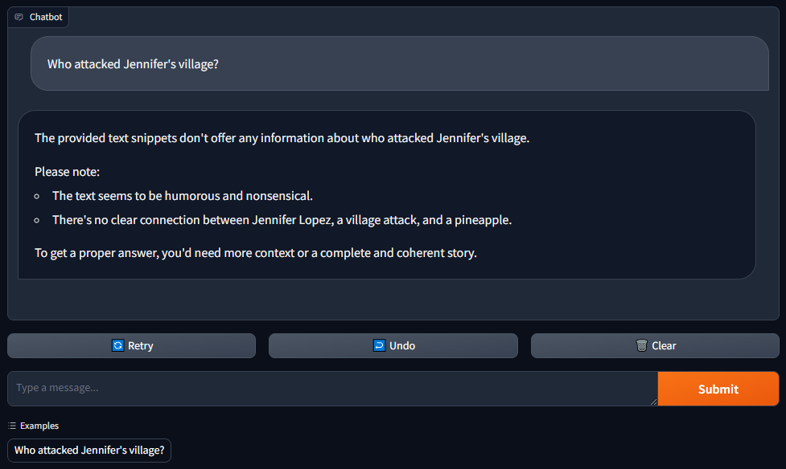

# ChatBot with LangChain, RAG, and Gradio

This project demonstrates how to build a chatbot capable of querying a database using Gradio, LangChain, and Retrieval-Augmented Generation (RAG). It includes a sample implementation using a Gemini model, but you can adapt it to use your own language model (LLM).

## Components

- **`Backend/ChatBot.py`**:
This file contains the abstract base class ChatBotTemplate for creating chatbot templates. It defines the structure for setting up the chain flow, preprocessing input messages, initializing the LLM model and RAG instance, and managing chat history.

- **`Backend/RAG.py`**: 
This file implements the RAG class for managing the FAISS database. It initializes the database, adds texts and documents to it, and provides a retriever instance for querying the database.

- **`app.py`**: 
This file sets up a Gradio interface for the chatbot. It initializes a Gemini instance with the path to the database and launches the Gradio interface for interacting with the chatbot.


## Usage
To run the chatbot, execute the following command:
```sh
python app.py
```
This will launch a Gradio interface where you can interact with the chatbot. Example queries can be provided, such as:

- "Who attacked Jennifer's village?"

## Customization
You can customize this project by modifying ChatBotTemplate to use different LLM models or document databases. Below is an example of how you can create your custom chatbot.


## Example Implementation: Gemini Chatbot

To illustrate how to use the provided structures, we have included a specific implementation using a Gemini model from Google Generative AI.

### `Gemini.py`

In `Gemini.py`, replace `"YOUR GOOGLE GEMINI API KEY"` with your actual Google Gemini API key:

```python
os.environ['GOOGLE_API_KEY'] = "YOUR GOOGLE GEMINI API KEY"
```

### `app.py`
In `app.py`, replace `"ABSOLUTE/PATH/TO/YOUR/DATABASE"` with the path to `database.txt` file:
```python
model = Gemini("database.txt")
```

Below is an example image of the Gradio interface you will interact with after running app.py:



## Conclusion
This project demonstrates how to integrate Gradio, LangChain, and RAG to build a powerful and customizable chatbot. By following the provided structure and examples, you can implement your own chatbot with your preferred LLM model and document database.

